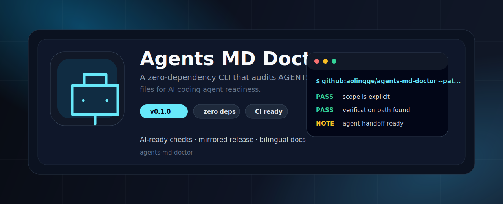

<p align="center">
  
</p>

<h1 align="center">AGENTS.md Doctor</h1>

<p align="center">
  A zero-dependency CLI that audits whether your <code>AGENTS.md</code> is useful enough for Codex, Claude Code, Cursor, and other AI coding agents.
</p>

<p align="center">
  <a href="README.zh-CN.md">中文</a> · <a href="#quick-start">Quick start</a> · <a href="#what-it-checks">Checks</a>
</p>

<p align="center">
  
  
  
</p>

## Why This Exists

`AGENTS.md` is becoming the repo-level instruction file for AI coding agents. The problem: many files say “be careful” but do not tell the agent what to read, what to run, where not to edit, or how to handle secrets.

This tool gives your agent guide a readiness score before you expect agents to use it.

## Quick Start

```bash
npx github:aolingge/agents-md-doctor
```

Check a specific file:

```bash
npx github:aolingge/agents-md-doctor --path AGENTS.md --min-score 80
```

Generate a report:

```bash
npx github:aolingge/agents-md-doctor --path AGENTS.md --markdown > agents-report.md
```

## What It Checks

| Check | Looks for |
| --- | --- |
| Purpose | The file clearly targets AI coding agents |
| Read order | Where the agent should start |
| Build/test commands | Exact commands, not vague advice |
| Editing boundaries | What is safe to change |
| Secret handling | Tokens, cookies, credentials, private logs |
| Git workflow | Dirty worktree and unrelated changes |
| Project map | Important folders and files |
| Verification | Evidence the agent should report before finishing |

## Output

```text
AGENTS.md score: 94/100
File: AGENTS.md

PASS  purpose          Explains that the file is for AI coding agents
PASS  read-order       Defines where agents should start reading
PASS  build-test       Includes concrete build/test/lint commands
FAIL  verification     Add a verification rule so agents report what they actually ran.
```

## Contributing

Open issues are intentionally small. Good first PRs include new checks, better wording, fixtures from real repositories, and docs for agent tools.

## License

MIT


## Quality Gate

Use this project as a repeatable gate before an AI agent marks work as done:

- [Quality gate guide](docs/quality-gates.md)
- [Copy-ready GitHub Actions example](examples/github-action.yml)

